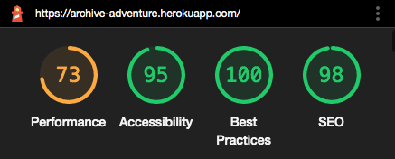
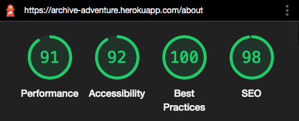
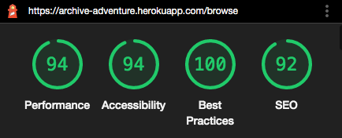
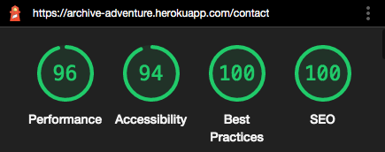
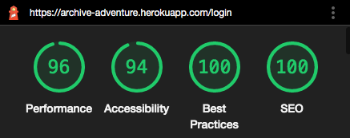
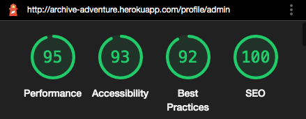
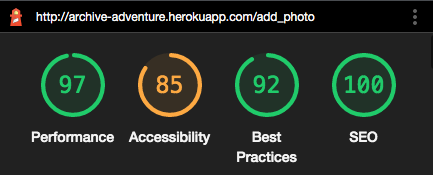
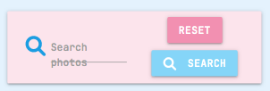

- [Encountered Issues](#ecountered-issues)

- [Testing User Stories](#testing-user-stories)
- [Testing Accessibility](#testing-accessibility)
- [Code Validation](#code-validation)
- [Known Issues](#known-issues)

## TESTING ACCESSIBILITY

### Home Page Results

The performance rating was low for the home page and Lighthouse suggested saving images in a file format other than .png or .jpg but this is not ideal as these formats are what most people save their photos as.

### About Us Results

### Browse Photos Results

### Contact Us Results

### Log In Results

### Admin Page Results

### Add Photo Results

## CODE VALIDATION

### CSS VALIDATION
Passed The W3C CSS Validation Service without any issues.

### HTML VALIDATION
There were a couple of issues when using The W3C Markup Validation Service however these were seen as warnings rather than major errors.

## KNOWN ISSUES

* On mobile devices, the search label currently covers two lines.

