- [Encountered Issues](#ecountered-issues)
- [Testing User Stories](#testing-user-stories)
- [Testing Accessibility](#testing-accessibility)
- [Code Validation](#code-validation)
- [Known Issues](#known-issues)

## ENCOUNTERED ISSUES

I came across many(!) issues during the creation of my site. Most that have been dealt with but there are some still ongoing which are noted at the end of this section.

- After using Flask Mail to try and connect the contact form with my gmail account, I kept getting this issue -

I discovered it was because I needed to have MFA with my gmail account. After setting this up, I was able to receive emails in my account.

- I had issues with the layout of my image cards after logging in and once the edit/delete buttons appeared.

I (finally) worked out it was due to Materialize setting the width at 50% and I needed to overwrite this and once I changed the width to 33%, the cards looked fine.

- I had a few issues of some of the cards being in the wrong place. I found this was due to a couple of stray 'end div' tags.

## TESTING USER STORIES

### First Time User
* Navigate the site easily, so that I can find what I need effectively.

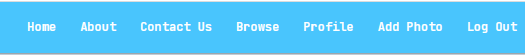

* View images without having to register first, so I can decide whether the site interests me or not.

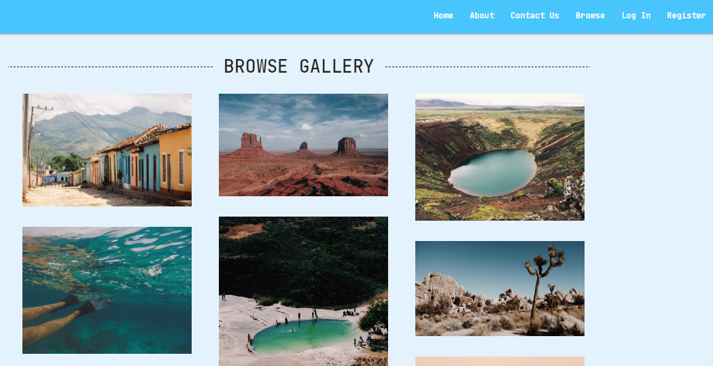

* Search the images by keyword or location.

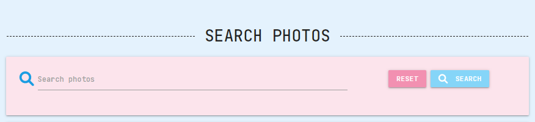

* Visit a site that is visually appealing and clear to understand.

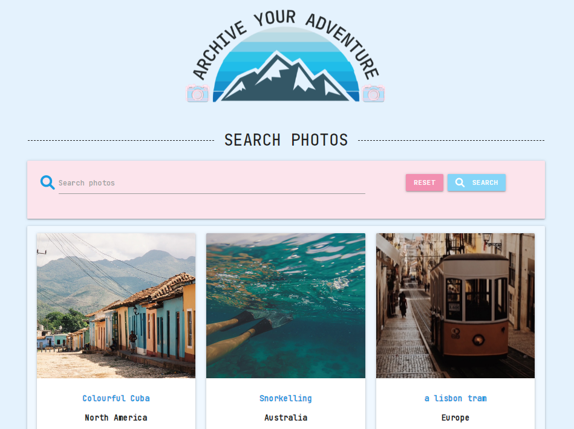

* Access the site across all devices and for it to be accessible, even on small screens.

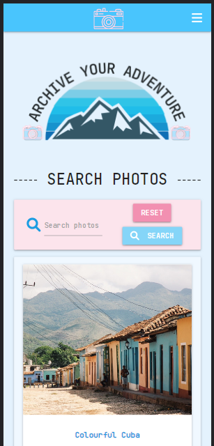

* Register an account and have a profile where I can keep track of any images I’ve uploaded.

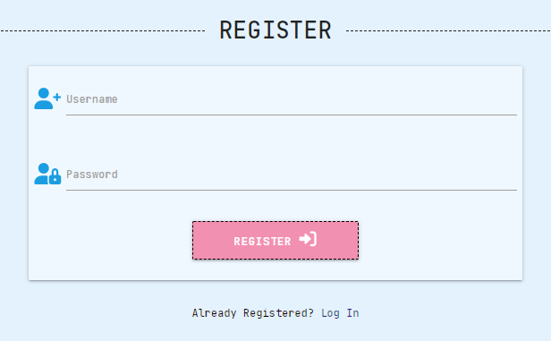

* Contact the site owner with any questions or comments I may have.

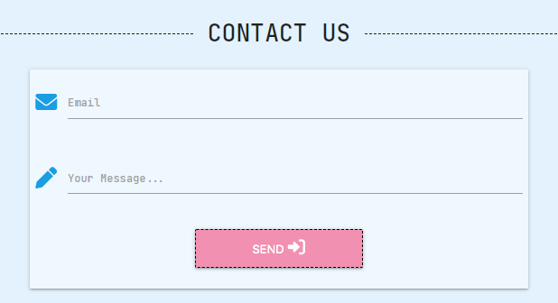

* Follow/view the various social media accounts of the site.

### Returning User
* Log in to the site and view my profile.

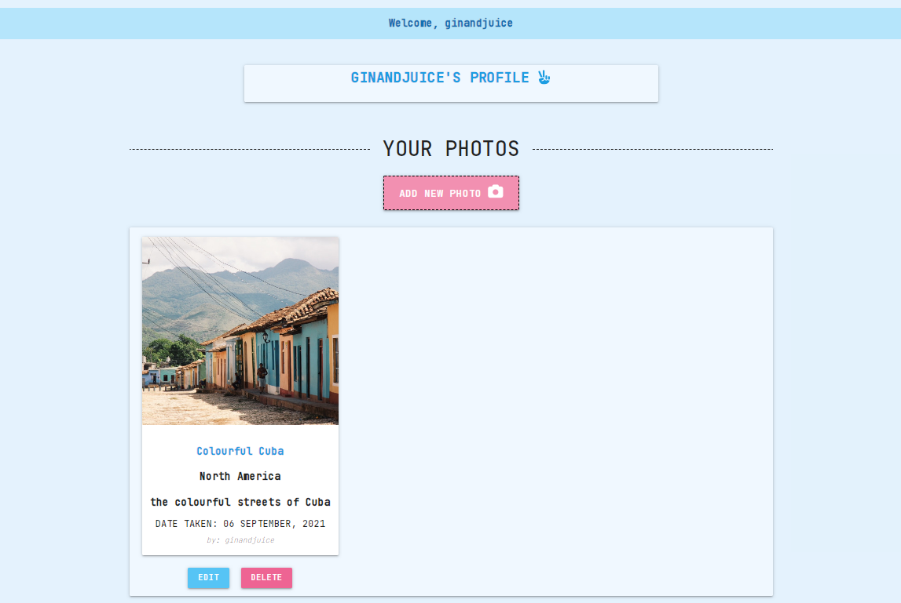

* Edit and/or delete my images that I’ve previously uploaded to the site.

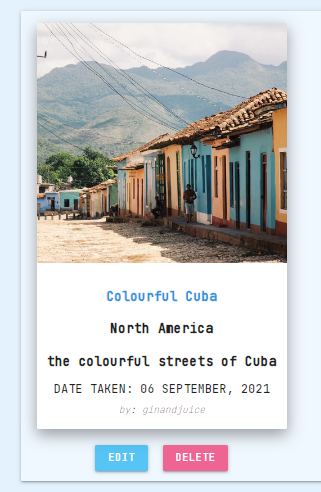

* Be prompted as to whether I want to delete my image or not, so I don’t do so by mistake.

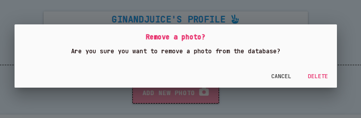

* Be able to see all images I’ve uploaded under my profile.

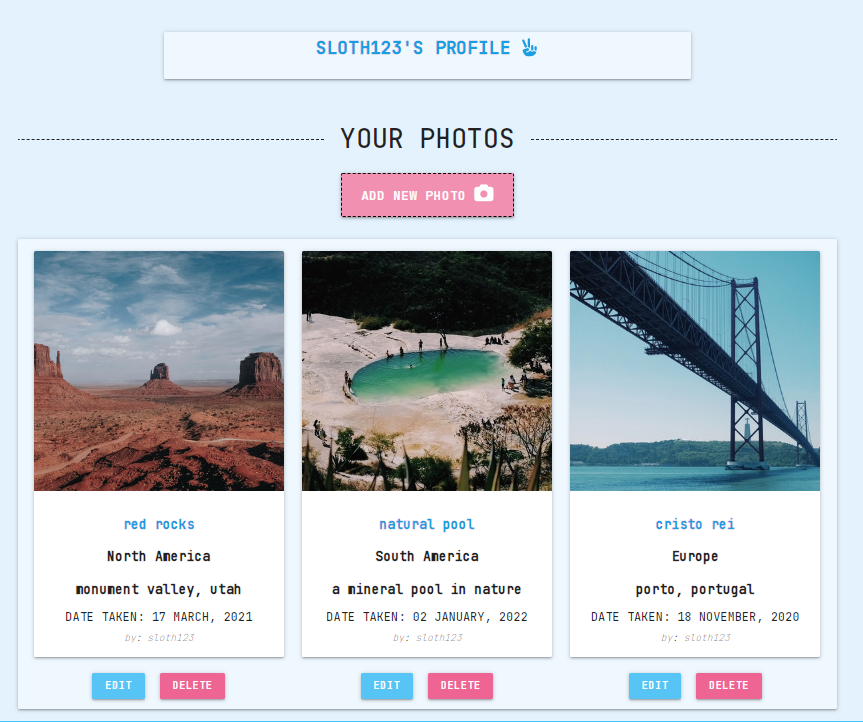

* Browse all images uploaded by other users.

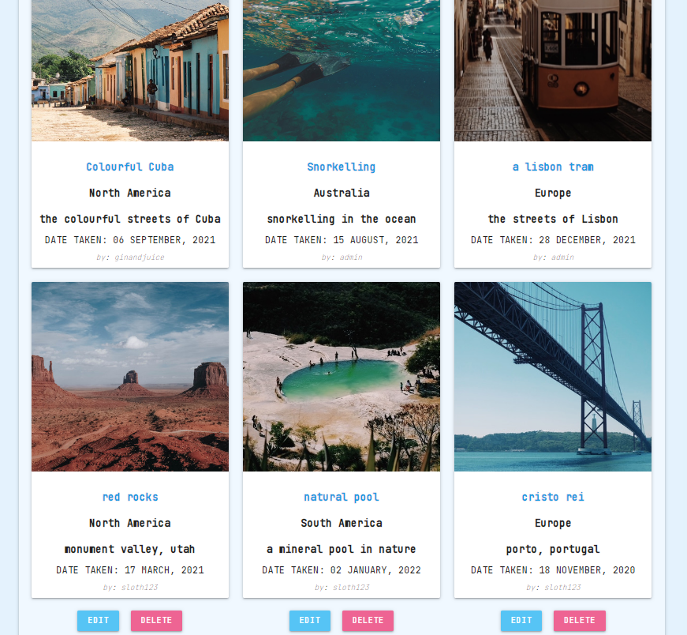

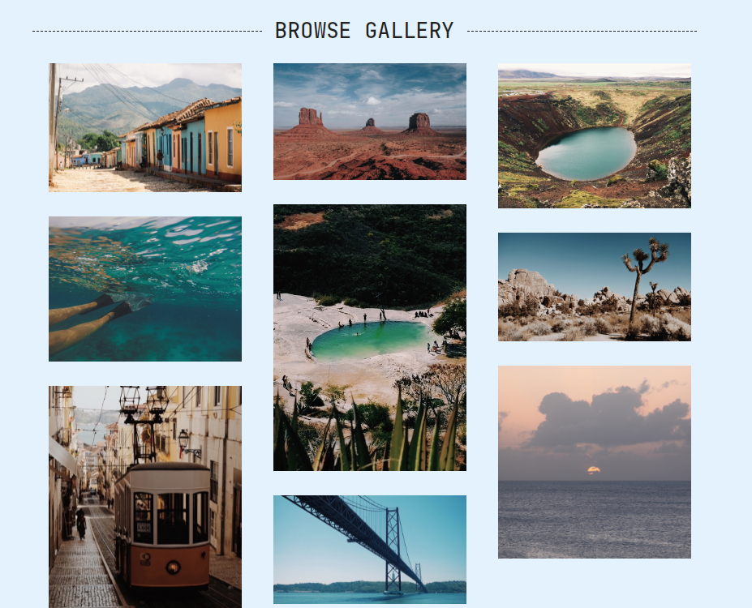

### Admin User
* Add my own images onto the site.

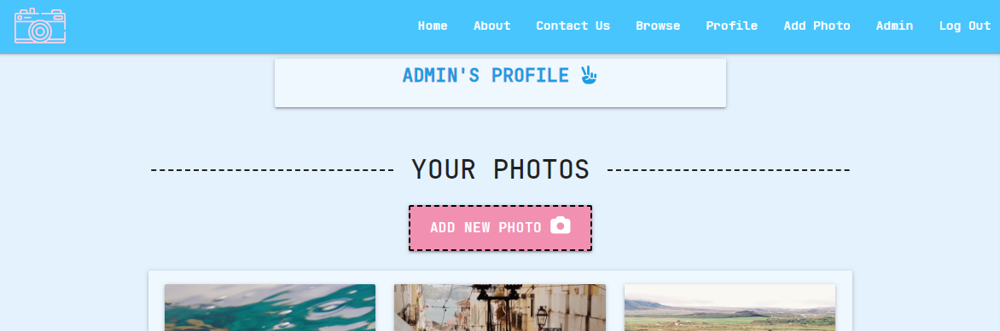

* Edit/Delete the images others have uploaded in case they are not appropriate.

## TESTING ACCESSIBILITY

### Home Page Results

The performance rating was low for the home page and Lighthouse suggested saving images in a file format other than .png or .jpg but this is not ideal as these formats are what most people save their photos as.

### About Us Results

### Browse Photos Results

### Contact Us Results

### Log In Results

### Admin Page Results

### Add Photo Results

## CODE VALIDATION

### CSS VALIDATION
Passed The W3C CSS Validation Service without any issues.

### HTML VALIDATION
There were a couple of issues when using The W3C Markup Validation Service however these were seen as warnings rather than major errors.
 * [Homepage](https://validator.w3.org/nu/?doc=https%3A%2F%2Farchive-adventure.herokuapp.com%2F)
 * [Browse](https://validator.w3.org/nu/?doc=https%3A%2F%2Farchive-adventure.herokuapp.com%2Fbrowse)
 * [About](https://validator.w3.org/nu/?doc=https%3A%2F%2Farchive-adventure.herokuapp.com%2Fabout)
 * [Contact](https://validator.w3.org/nu/?doc=https%3A%2F%2Farchive-adventure.herokuapp.com%2Fcontact)

## KNOWN ISSUES

* On some smaller devices, the search label currently covers two lines.

* The calendar cuts off the last letter of some months.

